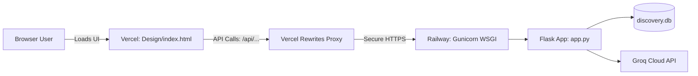

# Deployment Guide: Vercel (Frontend) & Railway (Backend)

This standalone guide provides step-by-step instructions and configuration details to deploy the **AI Discovery Engine** with the frontend hosted on **Vercel** and the backend API & database hosted on **Railway**.

---

## 1. Architecture Overview

| Component | Platform | Role | Key Files |
| :--- | :--- | :--- | :--- |
| **Frontend** | **Vercel** | Serves static PM dashboard & proxies `/api/*` requests | `Design/index.html`, `vercel.json` |
| **Backend** | **Railway** | Runs Flask API, Groq LLM pipelines & SQLite data | `app.py`, `Procfile`, `railway.json`, `discovery.db`, `requirements.txt` |



---

## 2. Configuration Files Created

The following deployment configuration files are already set up in the project:

### A. Railway Backend Configuration
1. **[`Procfile`](file:///c:/Users/ADMIN/Desktop/Product%20Owner%20Project%202/AI%20Discovered%20Engine/Procfile)**:
   ```text
   web: gunicorn app:app --bind 0.0.0.0:$PORT --workers 2 --timeout 120
   ```
2. **[`railway.json`](file:///c:/Users/ADMIN/Desktop/Product%20Owner%20Project%202/AI%20Discovered%20Engine/railway.json)**:
   Specifies Nixpacks build settings, dynamic `$PORT` assignment, and automatic restart policies.

### B. Vercel Frontend Configuration
1. **[`vercel.json`](file:///c:/Users/ADMIN/Desktop/Product%20Owner%20Project%202/AI%20Discovered%20Engine/vercel.json)**:
   Routes all dashboard visits to `Design/index.html` and rewrites `/api/*` calls directly to your Railway production URL.

---

## 3. Step-by-Step Deployment Instructions

### Step 1: Push Code to GitHub
Ensure all your files (`Design/`, `ingest/`, `app.py`, `discovery.db`, `Procfile`, `railway.json`, `vercel.json`) are committed:
```bash
git add .
git commit -m "Configure Vercel and Railway deployment"
git push origin main
```

---

### Step 2: Deploy Backend to Railway

1. Go to **[Railway.app](https://railway.app)** and sign in.
2. Click **"New Project"** ➔ Select **"Deploy from GitHub repo"**.
3. Choose your repository: `AI Discovered Engine`.
4. Once created, click on your service ➔ Open the **Variables** tab:
   - Add `GROQ_API_KEY`: *(paste your Groq API key from `.env`)*
   - Add `PORT`: `5000` *(Railway injects dynamic `$PORT` automatically, but setting default ensures fallback)*
5. Open the **Settings** tab ➔ Scroll to **Networking** ➔ Click **"Generate Domain"**.
   - Your backend domain will look like:
     `https://ai-discovered-engine-production.up.railway.app`
6. Verify deployment by opening in your browser:
   - `https://your-railway-url.up.railway.app/api/health` ➔ should return `{"status": "healthy"}`
   - `https://your-railway-url.up.railway.app/api/metrics` ➔ should return live metrics JSON

---

### Step 3: Connect Frontend on Vercel

1. Open **[`vercel.json`](file:///c:/Users/ADMIN/Desktop/Product%20Owner%20Project%202/AI%20Discovered%20Engine/vercel.json)** and replace:
   `https://REPLACE_WITH_YOUR_RAILWAY_URL` with your actual Railway URL from Step 2:
   ```json
   {
     "source": "/api/(.*)",
     "destination": "https://ai-discovered-engine-production.up.railway.app/api/$1"
   }
   ```
2. Commit and push this change to GitHub:
   ```bash
   git add vercel.json
   git commit -m "Update Railway backend URL in vercel.json"
   git push origin main
   ```
3. Go to **[Vercel.com](https://vercel.com)** and log in.
4. Click **"Add New..."** ➔ Select **"Project"**.
5. Import your GitHub repository.
6. Leave settings as default (Framework Preset: **Other**, Root Directory: `./`).
7. Click **Deploy**.
8. Within seconds, Vercel will give you a live URL (e.g. `https://myntra-ai-discovery.vercel.app`).

---

## 4. Verification Checklist

- [ ] **Frontend UI**: Open your Vercel URL. Check that the Myntra PM Dashboard loads with styling, fonts, and icons.
- [ ] **Data Sync**: Check that the 4 KPI cards (Conversations Processed, Core Barriers Detected, Wishlist Conversion, Users Analyzed) display dynamic numbers.
- [ ] **Barrier Matrix**: Confirm that the purchase barrier breakdown and opportunity prioritization tables populate.
- [ ] **Evidence Modal**: Click an evidence card to confirm customer quotes and AI reasoning appear.
- [ ] **AI Copilot & Hypotheses**: Ask a question in the PM AI Copilot chat or select a barrier from the dropdown to ensure Groq responds.

---

## 5. Maintenance & Database Persistence Note

- **SQLite Database (`discovery.db`)**: `discovery.db` is bundled into your deployment repository with full baseline data.
- **Persistent Pipeline Runs**: If you frequently trigger `/api/run-analysis` in production to scrape new live comments, add a **Railway Persistent Volume** mounted to `/data` so modifications persist across container restarts.
