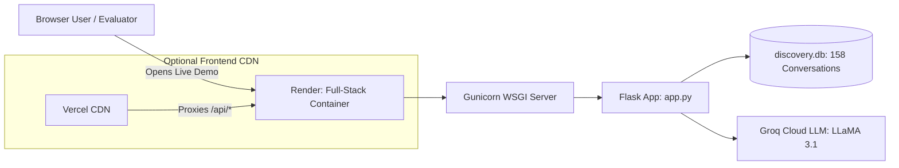

# Deployment Guide: Production Cloud Hosting

This document provides deployment instructions, live endpoints, and operational configurations for the **AI Discovery Engine** across **Render** (Full-Stack / Primary Backend) and **Vercel** (Frontend).

---

## 1. Live Production Deployments

| Component | Platform | Role | Live URL / Access |
| :--- | :--- | :--- | :--- |
| **Full-Stack Application** *(Primary)* | **Render** | Runs Gunicorn WSGI, Flask API, SQLite DB, and serves the PM Dashboard UI | 👉 **[https://myntra-wishlist-discovery-engine.onrender.com](https://myntra-wishlist-discovery-engine.onrender.com)** |
| **Frontend CDN** | **Vercel** | Static hosting & dynamic `/api/*` rewrites to Render backend | 👉 **[Vercel Dashboard](https://vercel.com/yashwanth-p-s/myntra-wishlist-discovery-engine)** |
| **Codebase** | **GitHub** | Version control & automated CI/CD deployment triggers | 👉 **[GitHub Repository](https://github.com/yashwanthps71097/myntra-wishlist-discovery-engine)** |



---

## 2. Configuration Files in the Repository

The project contains all required deployment configurations:

1. **[`Procfile`](file:///c:/Users/ADMIN/Desktop/Product%20Owner%20Project%202/AI%20Discovered%20Engine/Procfile)**:
   Specifies the Gunicorn WSGI start command for cloud containers:
   ```text
   web: gunicorn app:app --bind 0.0.0.0:$PORT --workers 2 --timeout 120
   ```
2. **[`railway.json`](file:///c:/Users/ADMIN/Desktop/Product%20Owner%20Project%202/AI%20Discovered%20Engine/railway.json)**:
   Configuration schema for Railway deployments (Nixpacks build settings, health checks).
3. **[`vercel.json`](file:///c:/Users/ADMIN/Desktop/Product%20Owner%20Project%202/AI%20Discovered%20Engine/vercel.json)**:
   Configures static file routing and rewrites `/api/*` calls to the live Render backend.
4. **[`.vercelignore`](file:///c:/Users/ADMIN/Desktop/Product%20Owner%20Project%202/AI%20Discovered%20Engine/.vercelignore)**:
   Prevents Vercel from bundling heavy Python and ML dependencies, ensuring instantaneous 2-second static deployments.
5. **[`requirements.txt`](file:///c:/Users/ADMIN/Desktop/Product%20Owner%20Project%202/AI%20Discovered%20Engine/requirements.txt)**:
   Contains all runtime dependencies, including `Flask`, `gunicorn`, `flask-cors`, and ML processing libraries.

---

## 3. How to Re-Deploy or Maintain Services

### A. Render (Primary Full-Stack Deployment)
1. Log in to **[dashboard.render.com](https://dashboard.render.com)**.
2. The Web Service is connected to GitHub repo `yashwanthps71097/myntra-wishlist-discovery-engine`.
3. **Build Command**: `pip install -r requirements.txt`
4. **Start Command**: `gunicorn app:app`
5. **Environment Variables**:
   * `GROQ_API_KEY`: Configured in Render settings.
6. Any git commit pushed to `main` triggers an automatic zero-downtime deployment.

### B. Vercel (Alternative Frontend CDN)
1. Connected to repository `yashwanthps71097/myntra-wishlist-discovery-engine`.
2. Serves static dashboard assets directly to Vercel's global Edge Network.
3. Automatically proxies data requests to the live Render backend.

---

## 4. Live API Health & Diagnostics

The production backend on Render can be verified using these endpoints:

| Endpoint | Method | Expected Output |
| :--- | :---: | :--- |
| **`/api/health`** | `GET` | `{"service": "AI Discovery Engine Backend", "status": "healthy"}` |
| **`/api/metrics`** | `GET` | Returns 158 processed reviews, 6 detected barriers, platform distribution |
| **`/api/barriers`** | `GET` | Returns opportunity matrix & impact scores |
| **`/api/evidence`** | `GET` | Returns verified user quotes with sentiment & severity scores |
| **`/api/hypotheses`** | `GET` | Returns dynamic testable hypothesis statements |

---

## 5. Persistence & Local Development

* **Local Server**:
  ```powershell
  python app.py
  ```
  Runs on **[http://127.0.0.1:5000](http://127.0.0.1:5000)**.
* **Database (`discovery.db`)**: Pre-populated SQLite relational database bundled directly with the application containing indexed reviews across all 8 assignment channels.
