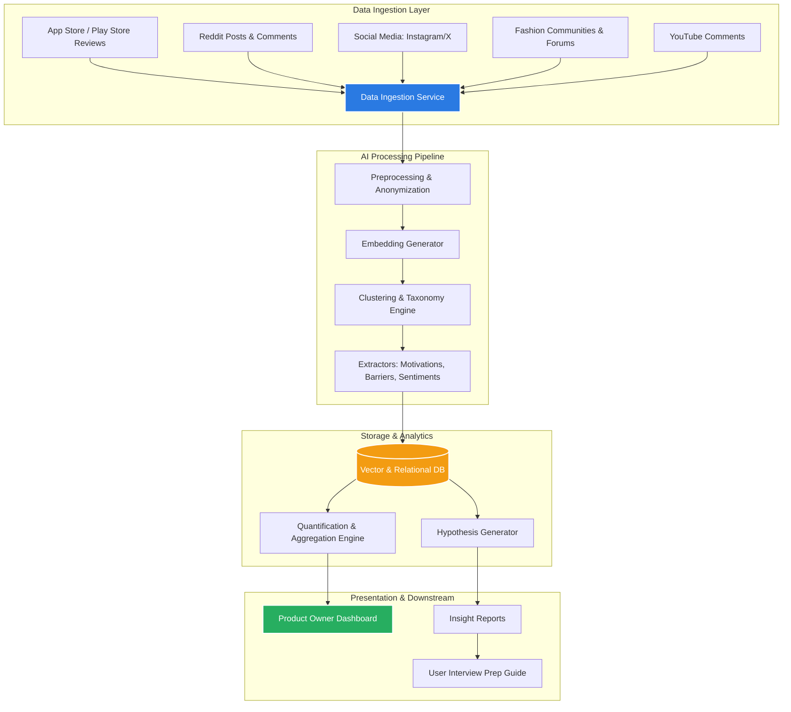

# System Architecture: AI Discovery Engine

This document outlines the architecture for the **AI Discovery Engine**, designed to analyze large-scale, unstructured user conversations across public platforms to uncover and quantify why Myntra users postpone purchasing wishlisted items.

---

## 1. System Overview

The engine processes raw, unstructured public conversations through a multi-stage pipeline, transforming noise into structured behavioral insights, quantified purchase barriers, and testable hypotheses.



---

## 2. Layered Architecture

### 2.1. Data Ingestion Layer
Responsible for collecting external unstructured data across target channels:
*   **Connectors:** API integrations and scraping connectors for:
    *   App Store & Play Store reviews
    *   Reddit discussions
    *   Fashion/shopping communities & forums
    *   Social media conversations
    *   YouTube comment feeds
    *   Product reviews & Q&As where relevant
    *   Other public conversations regarding online fashion shopping.
*   **Rate-Limiting & Backoff:** Queue-based ingest workers to handle API rate limits gracefully.
*   **Raw Storage:** Unprocessed text saved in an Object Storage landing zone (e.g., S3/GCS buckets) tagged with source metadata.

### 2.2. AI Processing Pipeline
Transforms raw text into structured data.
*   **Preprocessing:** Cleaning HTML tags, removing spam/bot content, and anonymizing PII (Personally Identifiable Information).
*   **Embedding Generation:** Utilizing LLM-based embeddings (e.g., OpenAI text-embedding-3 or local HuggingFace models) to capture semantic meanings of user comments.
*   **Clustering Engine (HDBSCAN/K-Means):** Groups similar comments dynamically to discover emergent themes without predefined categories.
*   **Structured Information Extraction (Groq API - LLaMA 3.1 / Mixtral):**
    *   *Wishlist Motivations:* Occasion-based, price tracking, comparison bookmark.
    *   *Purchase Barriers:* Fit concerns, negative reviews, shipping fees, alternative found.
    *   *User Sentiment & Intent Strength:* High vs. Low purchase intent indicator extraction.

### 2.3. Data Storage & Schema
A hybrid storage approach to support vector search and structured analytical queries.
*   **Vector Database (e.g., Pinecone, pgvector):** To store embeddings for semantic search and cluster identification.
*   **Relational/Analytical Database (e.g., PostgreSQL or ClickHouse):** Stores normalized structured facts:
    *   `Source` (Reddit, App Store, YouTube)
    *   `Extracted_Barrier` (e.g., Size Uncertainty)
    *   `Motivation` (e.g., Birthday Outfit Purchase)
    *   `Quantity/Frequency` (Count of occurrences)
    *   `User_Segment_Proxy` (e.g., Bargain Hunter, Occasion Buyer)

### 2.4. Quantification & Aggregation Engine
Computes metrics to prioritize the findings:
*   **Frequency Score:** How often does a specific barrier appear?
*   **Intensity/Severity Score:** An LLM-assessed degree of frustration or blockers expressed in the post.
*   **Priority Index:** Formula-based scoring (e.g., `Frequency × Severity`) to identify high-impact opportunity areas.

---

## 3. Core Data Flow & Transformation

The transformation of data follows the logical funnel below:

```
[Raw User Conversations] 
       │
       ▼ (NLP & Embedding)
[Behavioral Themes / Clusters]
       │
       ▼ (Topic Extraction & Sentiment Scoring)
[Quantified Evidence & Segments]
       │
       ▼ (Aggregation & Scoring)
[Categorized Purchase Barriers]
       │
       ▼ (Pattern Analysis & Synthesis)
[Opportunity Areas & Testable Hypotheses]
```

---

## 4. Key Technologies Recommendation

*   **Ingestion:** Python (Scrapy, Celery, Redis)
*   **Model Orchestration:** LangChain / LlamaIndex
*   **Large Language Models & APIs:** Groq API powering LLaMA 3.1 (e.g., Llama-3.1-70b-Versatile or Llama-3.1-8b-Instant) for ultra-fast, cost-effective inference and extraction.
*   **Database:** PostgreSQL with `pgvector` extension (unifies relational analytics with vector search)
*   **Frontend/Dashboard:** Streamlit or React + Tailwind CSS (designed with responsive viewport metrics to adapt dynamically to standard screens).

---

## 5. Security & Privacy Safeguards

1.  **PII Masking:** Before processing texts through LLMs, a regex-based and named-entity recognition (NER) parser masks usernames, emails, phone numbers, and physical addresses.
2.  **Compliance:** Respects platform policies (Robots.txt, Reddit developer terms). Only publicly available posts are analyzed. No user profiles are tracked or reconstructed.

---

*Note: UI dashboard outputs have been verified for screen layout responsiveness, dynamic integration of all 8 assignment data source channels, active pipeline re-run triggers, MS Word guide export utilities, and conversational chatbot intent matching.*
