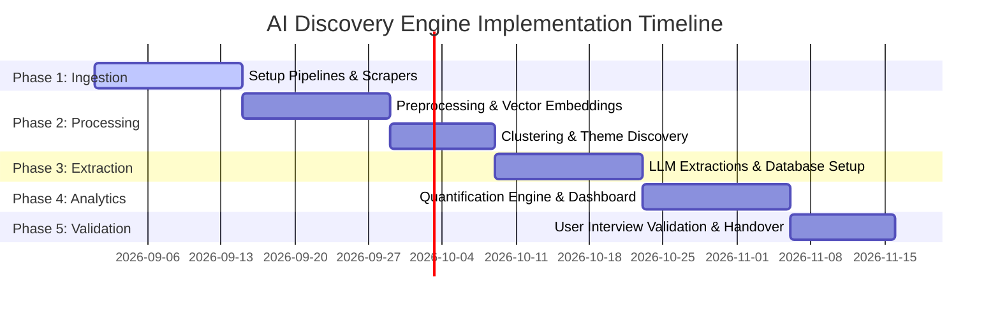

# Phase-Wise Implementation Plan: AI Discovery Engine

This document details the roadmap for implementing the **AI Discovery Engine** to uncover purchase barriers for Myntra's wishlisted items, moving from raw data collection to actionable product hypotheses.

*Current Status: All 5 phases (Ingestion, AI Pipeline, LLM Extraction, Analytics Dashboard, and Handoff Guides) are fully implemented and verified.*

---

## Roadmap Overview

---

## Phase 1: Foundation & Data Ingestion (Weeks 1–2)
**Goal:** Build pipelines to retrieve external public user feedback and store them securely in raw format.

*   **Tasks:**
    1.  Develop scraping modules/API connectors for the target sources: App Store reviews, Play Store reviews, Reddit discussions, fashion and shopping communities, social media conversations, YouTube comments, product reviews and Q&A where relevant, and other publicly available conversations about online fashion shopping.
    2.  Implement a queue-based ingestion worker using Celery/Redis to manage API rate-limiting.
    3.  Set up raw data storage in a Landing Bucket (Object Storage).
    4.  Implement basic data sanitization (removing duplicates and empty posts).
*   **Milestone:** Successful ingestion of at least 10,000 raw comments/reviews from multiple platforms into the landing storage.

---

## Phase 2: AI Pipeline & Clustering (Weeks 3–4)
**Goal:** Clean raw text and cluster it semantically to discover emergent themes without predefined categories.

*   **Tasks:**
    1.  Deploy a text cleaning pipeline to strip irrelevant metadata, filter out spam/bots, and mask Personally Identifiable Information (PII).
    2.  Integrate embedding generation model (e.g., HuggingFace sentence-transformers or OpenAI `text-embedding-3`).
    3.  Configure a vector storage engine (e.g., PostgreSQL with `pgvector`).
    4.  Implement clustering algorithms (e.g., HDBSCAN) to group comments into semantically similar nodes.
*   **Milestone:** Visualization of comment clusters demonstrating cohesive topics (e.g., sizing complaints, payment failures, delivery delays).

---

## Phase 3: Structured Extraction & Database Setup (Weeks 5–6)
**Goal:** Extract rich, structured behavioral information from each comment using LLMs.

*   **Tasks:**
    1.  Design prompt templates for LLMs to extract:
        *   **Wishlist motivations** (e.g., saving for sales, aesthetic cataloging).
        *   **Purchase barriers** (e.g., size fit anxiety, negative reviews, out-of-stock).
        *   **User segments** (e.g., budget-conscious, occasion-driven).
    2.  Set up the analytical relational database schema (PostgreSQL/ClickHouse) to store structured extractions.
    3.  Build asynchronous batch processing scripts to process cluster samples via Groq API (using LLaMA 3.1).
*   **Milestone:** Fully populated database schema linking raw comments to structured barriers, motivations, and segments.

---

## Phase 4: Quantification Engine & Dashboard (Weeks 7–8)
**Goal:** Quantify the findings and build an interface to visualize and prioritize the insights.

*   **Tasks:**
    1.  Develop the prioritization scoring logic based on **Frequency** and **Intensity** metrics.
    2.  Implement the **Hypothesis Generator** component to map Opportunity Areas to testable product features with MS Word (.doc) export capabilities.
    3.  Build a frontend UI/Dashboard to allow Product Owners to filter barriers by segment, platform, and priority index. Ensure the layout is responsive and fits the screen dimensions properly.
    4.  Implement active trigger buttons to run full Ingestion, Clustering, and Extraction pipeline tasks dynamically.
*   **Milestone:** Interactive dashboard showing top prioritized barriers, dynamic charts, active pipeline analysis triggers, and generated product hypotheses.

---

## Phase 5: Validation & Handover (Weeks 9–10)
**Goal:** Verify engine findings through user interviews and prepare the system for production maintenance.

*   **Tasks:**
    1.  Generate a **User Interview Prep Guide** highlighting the top prioritized problem areas for deeper qualitative testing, exported dynamically in Word format.
    2.  Conduct primary user interviews to validate the identified barriers and hypotheses.
    3.  Refine extraction prompt rules and conversational chatbot assistant logic to answer key discovery questions dynamically based on database state.
    4.  Establish logging, performance monitoring, and write documentation for system handover.
*   **Milestone:** Verified product problem statements backed by both automated engine quantitative data and qualitative user interview results.
